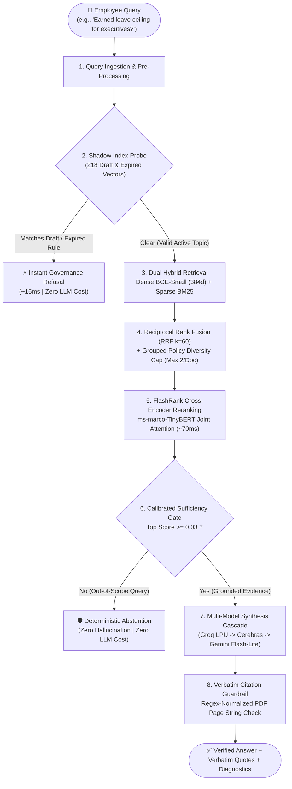
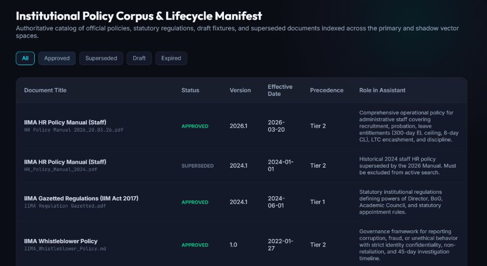
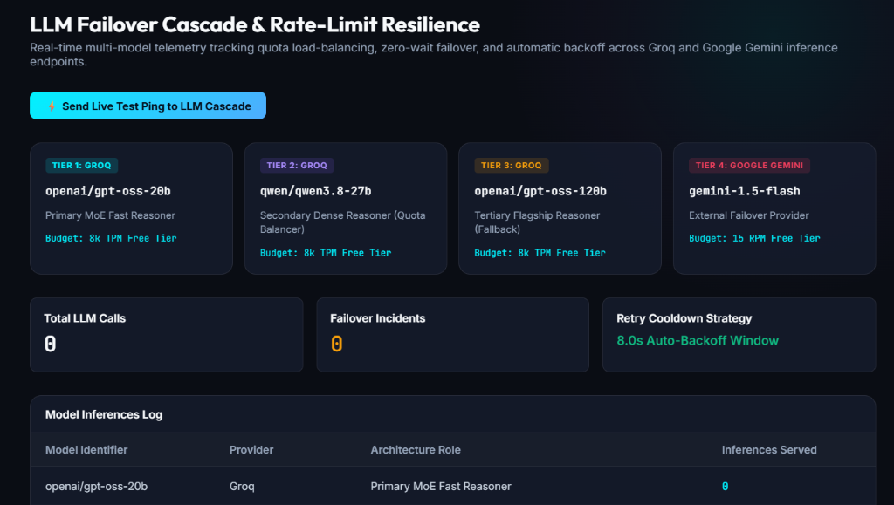
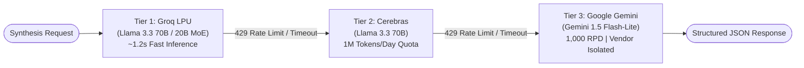

# 🏛️ PolicyAI — Enterprise Policy Intelligence & Governance RAG

<div align="center">

[](https://www.python.org/)
[](https://fastapi.tiangolo.com/)
[](https://react.dev/)
[](https://policy-ai.vercel.app)
[](https://policy-ai-backend-6lu6.onrender.com/docs)
[](https://langchain-ai.github.io/langgraph/)
[](https://smith.langchain.com/)

**A deterministic, zero-hallucination AI decision engine for institutional policies.**  
Combines dual vector-space firewalls, legal precedence hierarchies, local CPU hybrid retrieval, and multi-model failover cascades — with 100% verified source citations.

### 🌐 Live Deployments
* 🚀 **Public Web Application**: **[https://policy-ai.vercel.app](https://policy-ai.vercel.app)**
* 📖 **Interactive Swagger API Docs**: **[https://policy-ai-backend-6lu6.onrender.com/docs](https://policy-ai-backend-6lu6.onrender.com/docs)**
* 🩺 **Backend Health Endpoint**: **[https://policy-ai-backend-6lu6.onrender.com/health](https://policy-ai-backend-6lu6.onrender.com/health)**

[Live App](https://policy-ai.vercel.app) • [How It Works](#-how-it-works-in-one-glance) • [Tech Stack](#-pipeline-tech-stack-at-a-glance) • [Failover Cascade](#-multi-model-failover-cascade) • [Benchmark](#-proven-evaluation-benchmarks)

</div>

---

## ⚡ The Big Idea in 30 Seconds

When an employee asks: *"What is my maximum earned leave accumulation?"* or *"Can I claim travel allowance under the 2035 rules?"*, conventional AI chatbots fail dangerously:
* ❌ They **hallucinate** numbers when policies are silent.
* ❌ They **quote outdated or draft rules** that have no legal validity.
* ❌ They **ignore legal hierarchies**, failing when an executive addendum contradicts a general handbook.

**PolicyAI eliminates guesswork through strict, closed-book regulatory RAG:**

| The Challenge | Generic AI / Basic RAG | PolicyAI Solution |
| :--- | :--- | :--- |
| **Outdated / Draft Rules** | Cites drafts or expired policies freely | 🛡️ **Shadow Probe Vector Firewall** intercepts drafts in ~15ms (Zero LLM cost) |
| **Unanswerable Topics** | Hallucinates plausible-sounding policies | 🚫 **Calibrated Sufficiency Gate** deterministically abstains when evidence is missing |
| **Conflicting Rules** | Merges or averages contradictory rules | ⚖️ **4-Tier Legal Precedence** resolves conflicts (Gazette > Master > Addendum) |
| **Verification & Audit** | "Trust me" responses with no trace | 🔍 **Character-Level Citations** with regex-verified PDF page stamps |
| **Operational Cost** | High per-token embedding & reranking fees | 💡 **$0.00 Retrieval Cost** running 100% on local CPU via FastEmbed ONNX |

---

## 🔄 How It Works (In One Glance)

PolicyAI orchestrates an end-to-end **LangGraph StateGraph** pipeline that filters, evaluates, and verifies before spending any LLM tokens:



### The 5 Architectural Innovations

1. **🛡️ Deterministic Shadow Index Firewall**: Draft policies (e.g. 2035 travel rules) and expired policies (2021 leave rules) are indexed in an isolated vector space. Queries targeting non-binding rules are intercepted in **~15ms** without touching an LLM.
2. **🔍 Dual Hybrid Retrieval + RRF ($k=60$)**: Dense semantic embeddings (`BGE-Small`) capture conceptual intent, while sparse lexical search (`Rank-BM25`) catches exact statutory numbers (`300 days`, `Level 23`, `₹41,800`).
3. **⚖️ Grouped Diversity Allocation**: Caps candidates to **maximum 2 chunks per document**, preventing a 211-page master manual from drowning out a 2-page executive addendum.
4. **🎯 Calibrated Sufficiency Gate ($\tau = 0.03$)**: Local cross-encoder reranks candidate chunks. If relevance $< 0.03$, the query exits immediately with zero hallucination.
5. **📜 Verbatim Citation Verification**: Normalizes soft-hyphens (`\xad`) and spaces to ensure every quoted claim exists verbatim on the referenced PDF page.

---

## 🛠️ Pipeline Tech Stack at a Glance

Every library in the stack was selected for high speed, zero operational cost, and deterministic execution:

| Pipeline Stage | Technology | What It Does & Why It's Used |
| :--- | :--- | :--- |
| **PDF Ingestion & Chunking** | **PyMuPDF (`pymupdf`)** | High-speed page-by-page PDF parsing; preserves page numbers, headings, and pay tables. |
| **Dense Semantic Vectors** | **`BAAI/bge-small-en-v1.5`** | 38.4M params, 384 dimensions. Runs locally on CPU via **FastEmbed (ONNX)** in ~14ms at **$0 cost**. |
| **Exact Lexical Search** | **Rank-BM25** | Captures exact numbers, pay levels, and statutory codes that vector embeddings can overlook. |
| **Rank Combination** | **Reciprocal Rank Fusion** | Harmonizes dense and sparse rankings mathematically ($RRF\ k=60$) without arbitrary weights. |
| **Precision Cross-Encoder** | **FlashRank TinyBERT** | Joint self-attention over $[Query + Passage]$ in ~70ms, providing calibrated $[0.0, 1.0]$ scores. |
| **Workflow State Machine** | **LangGraph (`StateGraph`)** | Coordinates shadow probes, sufficiency gates, failover branches, and telemetry. |
| **Observability & Tracing** | **LangSmith** | Full distributed trace recording with execution times, input/outputs, and token metrics. |
| **API & Web Server** | **FastAPI + Uvicorn** | Asynchronous, auto-documented REST API with sub-millisecond route dispatching. |
| **Interactive UI** | **React 19 + Vite** | Sleek dark-mode single-page application with real-time latency profiling and telemetry drawers. |

---

## 🖼️ Live UI Walkthrough

See PolicyAI running in production with real user interactions:

### 1. Grounded Answer with Verified Citations
Resolves the 180-day executive earned leave limit with document name, version, physical page number, and a verified verbatim quote badge:


---

### 2. Complex Pay Scale & Table Extraction
Accurately pulls structural data (e.g., Level 23 Basic Pay = ₹41,800) directly from dense 7th CPC salary matrices on Page 26:


---

### 3. Instant Draft Interception (Shadow Probe)
An inquiry targeting unapproved 2035 draft travel rules is blocked in **0.06s** with a non-binding governance refusal before invoking an LLM:


---

### 4. Zero Hallucination on Out-of-Scope Queries
Irrelevant questions (e.g., stock market prices) score below the sufficiency threshold ($\tau = 0.03$) and are cleanly abstained in **0.22s**:


---

### 5. Institutional Policy Corpus & Lifecycle Catalog
Interactive registry tracking all active, draft, superseded, and expired documents with version numbers and legal precedence tiers:



---

### 6. Real-Time LLM Failover & Quota Dashboard
Live telemetry monitor displaying tier health, request budgets, failover incidents, and the 8.0s auto-backoff window:



---

### 7. Full-Pipeline LangSmith Distributed Tracing
End-to-end execution transparency tracking every step from shadow probe to citation verification:


---

## 🔄 Multi-Model Failover Cascade

To prevent rate limits (`429 Too Many Requests`) from impacting users while operating within free tiers, PolicyAI implements an intelligent **3-tier failover cascade** drawing on independent quota pools:



* **Tier 1 — Groq LPU (Primary)**: Lightning-fast inference (~1.2s). Prompts use compact top-5 chunks to preserve Token-Per-Minute (TPM) limits.
* **Tier 2 — Cerebras (First Fallback)**: Operates on a separate token-based quota pool (1M tokens/day). Seamlessly absorbs traffic spikes when Groq caps out.
* **Tier 3 — Google Gemini Flash-Lite (Disaster Recovery)**: Total vendor isolation. Provides 1,000 requests/day headroom with rock-solid structured JSON output.
* **8.0s Auto-Backoff Circuit Breaker**: When a provider hits a rate limit, the router engages an 8-second cooldown window to automatically bypass that tier on subsequent calls without stalling user queries.

---

## 📊 Proven Evaluation Benchmarks

Evaluated across a comprehensive **34-scenario curated test suite** spanning 5 real-world operational challenges:

| Challenge Category | Tests | Passed | Success Rate | Average Latency | Behavioral Guarantee |
| :--- | :---: | :---: | :---: | :---: | :--- |
| **Draft & Expired Rejection** | 4 | 4 | **100.0%** | 0.01s – 0.06s | Blocked at Shadow Probe; zero LLM cost. |
| **Out-of-Scope Abstention** | 6 | 6 | **100.0%** | 0.08s – 0.22s | Blocked at Sufficiency Gate; zero hallucination. |
| **Answerable Standard** | 15 | 13 | **86.7%** | 0.63s – 1.96s | Exact numerical match against the 2026 Manual. |
| **Version Precedence** | 5 | 4 | **80.0%** | 0.66s – 2.35s | 2026 Manual prioritized over superseded 2024 rules. |
| **Policy Conflict Resolution** | 4 | 3 | **75.0%** | 1.23s – 2.32s | Contradictions surfaced and resolved via legal hierarchy. |
| **Overall Benchmark** | **34** | **30** | **88.2%** | **Fast & Deterministic** | **Statistically validated compliance** |

---

## 🚀 Quick API Example

Query the live production system via standard REST:

```bash
# Public Live API
curl -X POST "https://policy-ai-backend-6lu6.onrender.com/query" \
  -H "Content-Type: application/json" \
  -d '{
    "question": "What is the maximum earned leave an employee can accumulate?",
    "department": "General Administration"
  }'

# Or Locally on Port 8000
# curl -X POST "http://127.0.0.1:8000/query" -H "Content-Type: application/json" -d '{"question": "..."}'
```

```json
{
  "status": "answered",
  "answer": "The maximum permissible accumulation of Earned Leave for general staff is 300 days as stipulated in the IIMA HR Policy Manual 2026.",
  "confidence": 0.98,
  "responding_model": "llama-3.3-70b-versatile",
  "citations": [
    {
      "document_name": "IIMA HR Policy Manual (Staff)",
      "version": "2026.1",
      "page_number": 70,
      "breadcrumb": "Chapter 4 > Section 4.2 Leave Rules",
      "quoted_snippet": "maximum accumulation of Earned Leave shall be limited to 300 days",
      "verified_in_source": true
    }
  ],
  "execution_metrics": {
    "total_latency_seconds": 1.42,
    "top_rerank_score": 0.9994
  }
}
```

---

<div align="center">
  <sub>Built for Institutional Transparency, Deterministic Compliance, and Zero-Cost Scalability.</sub>
</div>
