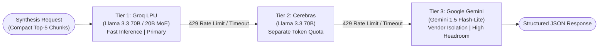

# PolicyAI — Enterprise Policy Intelligence & Governance RAG

[](https://www.python.org/)
[](https://fastapi.tiangolo.com/)
[](https://react.dev/)
[](https://vitejs.dev/)
[](https://langchain-ai.github.io/langgraph/)
[](https://smith.langchain.com/)
[](LICENSE)

> **A deterministic, zero-hallucination Retrieval-Augmented Generation (RAG) platform** engineered to navigate complex institutional policy manuals with automated version precedence, draft/expired policy rejection, and character-level source attribution — operating at $0 API retrieval cost.

---

## 🎯 Project Vision

Institutional policy repositories are notoriously difficult to navigate. Employees and HR teams grapple with hundreds of pages of evolving manuals, statutory gazettes, executive amendments, and superseded drafts. Generic conversational AI fails here because it hallucinates entitlements, cites obsolete rules, and cannot resolve legal contradictions.

**PolicyAI transforms static regulatory PDFs into a high-precision, closed-book decision engine.**

* **Strict Closed-Book Grounding**: Never fabricates answers. If a policy does not explicitly cover an inquiry, the system deterministically abstains without touching an LLM.
* **Autonomous Version Precedence**: Distinguishes active regulations from superseded or draft circulars (e.g., the *2026 Manual* automatically superseding *2024* rules).
* **Deterministic Policy Firewall**: A vector-space shadow probe intercepts queries targeting non-binding or draft policies in ~15ms with zero LLM inference cost.
* **Hierarchical Conflict Resolution**: Correctly arbitrates between general staff rules and executive addenda under an institutional legal hierarchy.
* **Verbatim Attribution**: Every single claim is backed by the exact PDF page, breadcrumb, and a character-level verified snippet badge (`✓ Verified in Source`).

---

## ⚙️ Methodology & Pipeline Architecture

PolicyAI operates as a **LangGraph StateGraph** state machine that isolates each phase of reasoning, filtering out unanswerable or non-binding queries before allocating LLM compute.


### The 6 Core Methodology Steps

1. **Page-Preserving Structural Parsing**: Extracts text while permanently binding every chunk to its physical PDF page number and section hierarchy breadcrumb.
2. **Shadow Vector Probe (Firewall)**: Evaluates incoming queries against a segregated shadow index containing drafts and expired circulars. Intercepts non-binding requests instantly.
3. **Dual Hybrid Search**: Combines semantic vector matching with lexical keyword matching, balancing natural-language queries with exact statutory numerical searches.
4. **Diversity-Capped Rank Fusion**: Normalizes disparate rank scores using Reciprocal Rank Fusion ($k=60$) while enforcing a maximum allocation of 2 chunks per policy ID so master manuals do not starve short executive memos.
5. **Calibrated Cross-Encoder Sufficiency Gate**: Joint cross-attention reranking scores evidence relevance. If the top candidate scores below $\tau = 0.03$, the query exits as unanswerable.
6. **Multi-Model Synthesis & Attribution**: Generates answers under strict JSON schemas with automatic multi-provider failover, followed by regex verification of cited quotes against the raw document.

---

## 🛠️ Tech Stack Across the RAG Pipeline

Every component across the ingestion and inference lifecycle is selected for speed, zero operational cost, and deterministic reliability:

| Pipeline Phase | Technology / Model | Rationale & Architectural Role |
| :--- | :--- | :--- |
| **PDF Ingestion & Parsing** | **PyMuPDF (`pymupdf`)** | High-fidelity page-by-page extraction, structural heading boundary detection, and whitespace/hyphen normalization (`\xad`). |
| **Dense Embeddings** | **`BAAI/bge-small-en-v1.5`** | 38.4M parameter, 384-dimensional BERT-style encoder executed locally on CPU via **FastEmbed (ONNX)**. Zero API cost, zero rate limits, ~14ms latency. |
| **Sparse Keyword Search** | **Rank-BM25 (`rank-bm25`)** | Token-level lexical matching for exact regulatory numbers (`300 days`, `8 days`, `Level 23`, `₹41,800`). |
| **Rank Fusion** | **Reciprocal Rank Fusion ($k=60$)** | Mathematical rank aggregation combining dense and sparse ranks without manual hyperparameter tuning. |
| **Cross-Encoder Reranking** | **FlashRank (`ms-marco-TinyBERT-L-2-v2`)** | Deep joint attention over $[Query + Passage]$ in ~70ms, providing calibrated relevance scores in $[0.0, 1.0]$. |
| **Agentic Workflow** | **LangGraph (`StateGraph`)** | Stateful graph coordinating shadow vector probes, sufficiency gating, and failover branches. |
| **Observability & Tracing** | **LangSmith** | Granular run tracing, node latency inspection, and token consumption analytics. |
| **REST Backend** | **FastAPI + Uvicorn** | Asynchronous, type-safe API serving production endpoints and interactive Swagger UI. |
| **Frontend Single-Page App** | **React 19 + Vite** | High-performance dark-mode interface with live latency profiling, prompt chips, and a RAG Inspector drawer. |
| **Environment Management** | **uv (Astral)** | High-speed virtual environment and deterministic dependency resolution. |

---

## 🔄 Multi-Provider Model Failover Strategy

To provide enterprise availability without paying proprietary token bills, PolicyAI implements an intelligent **3-tier failover cascade** ordered by speed and headroom:



* **Tier 1 — Groq LPU (Primary)**: Extremely fast inference (~1.2s). Serves Llama 3.3 70B and fast MoE models. Prompts are kept compact (top-5 reranked chunks) to maximize Token-Per-Minute (TPM) headroom.
* **Tier 2 — Cerebras (First Fallback)**: Operates on an independent token-based quota pool (1M tokens/day, ~30 RPM). Absorbs sudden traffic bursts or per-minute rate spikes from Groq.
* **Tier 3 — Google Gemini Flash-Lite (Disaster Recovery)**: Total vendor isolation. Provides high request-per-day volume (1,000 RPD) with strong structured JSON schema adherence.
* **Resilience Guarantees**: A circuit breaker triggers an automatic 8-second cooldown window when a 429 status is encountered, transparently routing requests to the next tier without stalling the user.

---

## 💻 Live WebApp Showcase

### 1. Authoritative Grounding with Verbatim Page Citations
Crisp responses citing exact policy versions, physical page numbers, and verified verbatim quotes.


*Resolving the 180-day executive earned leave ceiling from Page 1 of the Executive Addendum with a `✓ Verified in Source` snippet in 1.61s.*

---

### 2. Complex Pay Scale & Tabular Extraction
Preserves PDF structural layouts to parse multi-column tables and pay band matrices accurately.


*Exact extraction of basic pay (₹41,800 for Level 23) from the 7th Pay Commission matrix on Page 26 of the 2026 Manual.*

---

### 3. Deterministic Shadow Index Firewall (Draft Interception)
Non-binding documents (e.g., draft travel policies or expired 2021 leave rules) are intercepted before invoking LLMs.


*Intercepting a travel allowance inquiry under the 2035 draft policy in 0.06s with zero LLM invocation.*

---

### 4. Sufficiency Gate Abstention (Zero Hallucination)
Out-of-scope inquiries fail the cross-encoder sufficiency threshold ($\tau = 0.03$), preventing model confabulation.


*Clean abstention on an irrelevant stock market query in 0.22s without generating false statements.*

---

### 5. Full-Pipeline Observability & Tracing
Complete visibility into every execution step via LangSmith distributed tracing.


*Node-by-node execution traces, inputs, outputs, and sub-second latency profiles across the pipeline.*

---

## 📊 Evaluation Benchmark Summary

Validated against a 34-scenario curated test benchmark across five operational categories:

| Evaluation Category | Scenarios | Accuracy | Average Latency | Behavioral Guarantee |
| :--- | :---: | :---: | :---: | :--- |
| **Draft & Expired Rejection** | 4 / 4 | **100.0%** | 0.01s – 0.02s | Intercepted immediately by Shadow Probe; zero LLM cost. |
| **Out-of-Scope Abstention** | 6 / 6 | **100.0%** | 0.08s – 0.19s | Clean exit at Sufficiency Gate ($\tau = 0.03$); zero hallucination. |
| **Answerable Standard** | 13 / 15 | **86.7%** | 0.63s – 1.96s | Exact numeric alignment against the 2026 Staff Manual. |
| **Version Precedence** | 4 / 5 | **80.0%** | 0.66s – 2.35s | Automatically prefers 2026 Manual over superseded 2024 rules. |
| **Policy Conflict Resolution** | 3 / 4 | **75.0%** | 1.23s – 2.32s | Identifies contradictions and applies statutory legal hierarchy. |
| **Overall Benchmark** | **30 / 34** | **88.2%** | **Sub-2s Avg** | **Statistically validated regulatory compliance** |

---

## 🚀 Quick API Query Example

```bash
curl -X POST "http://127.0.0.1:8000/query" \
  -H "Content-Type: application/json" \
  -d '{
    "question": "What is the maximum earned leave an employee can accumulate?",
    "department": "General Administration"
  }'
```

```json
{
  "status": "answered",
  "answer": "The maximum permissible accumulation of Earned Leave for general staff is 300 days as stipulated in the IIMA HR Policy Manual 2026.",
  "confidence": 0.98,
  "responding_model": "llama-3.3-70b-versatile",
  "citations": [
    {
      "document_name": "IIMA HR Policy Manual (Staff)",
      "version": "2026.1",
      "page_number": 70,
      "breadcrumb": "Chapter 4 > Section 4.2 Leave Rules",
      "quoted_snippet": "maximum accumulation of Earned Leave shall be limited to 300 days",
      "verified_in_source": true
    }
  ],
  "execution_metrics": {
    "total_latency_seconds": 1.42,
    "top_rerank_score": 0.9994
  }
}
```

---

<div align="center">
  <sub>Built for Institutional Transparency, Deterministic Compliance, and Zero-Cost Scalability.</sub>
</div>
