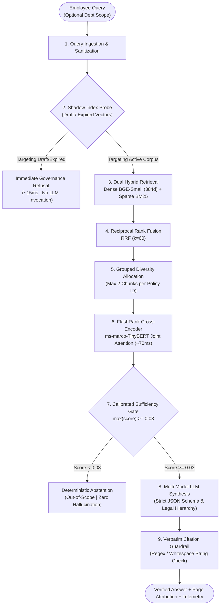
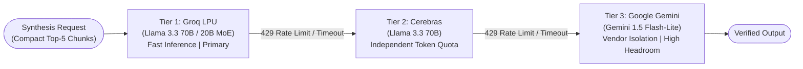
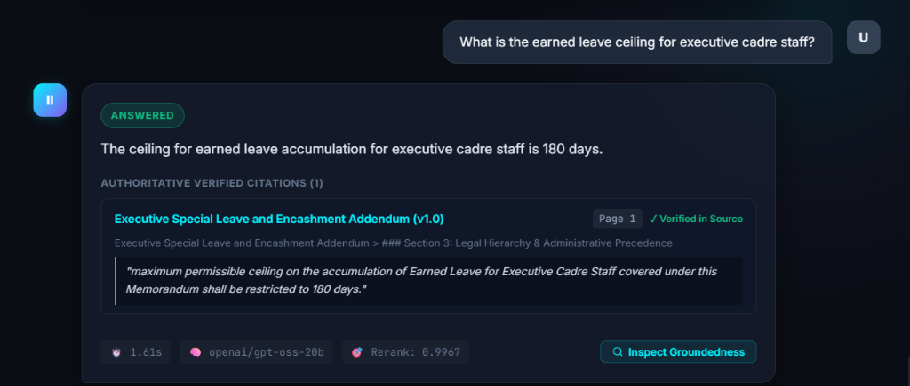
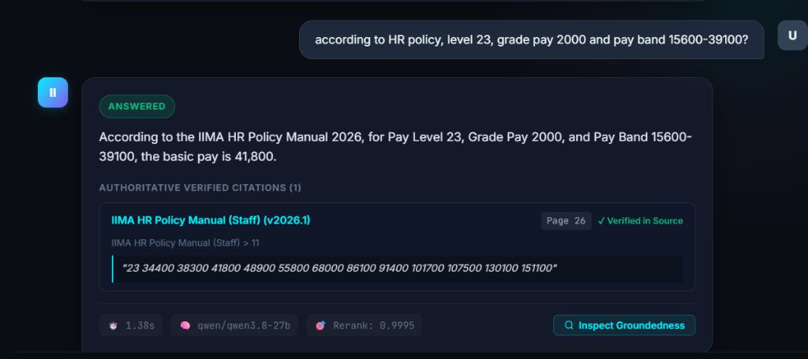
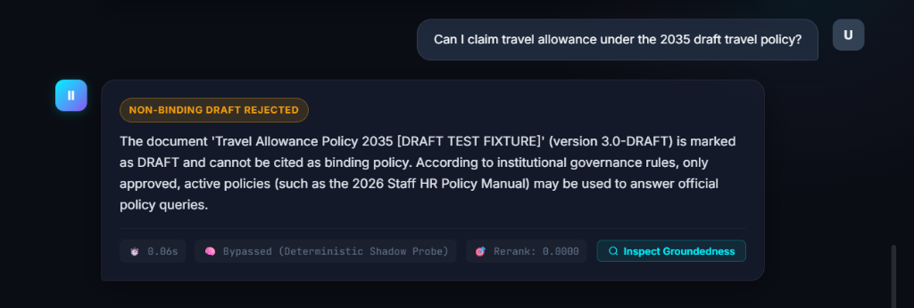
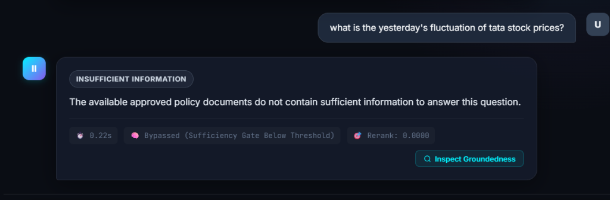
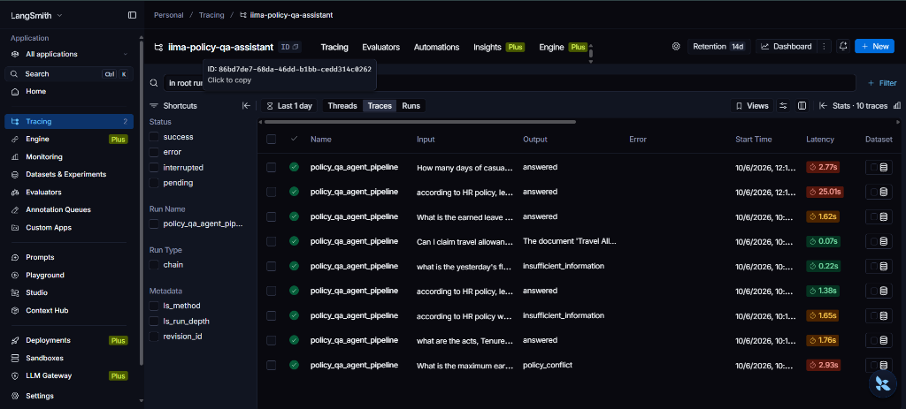
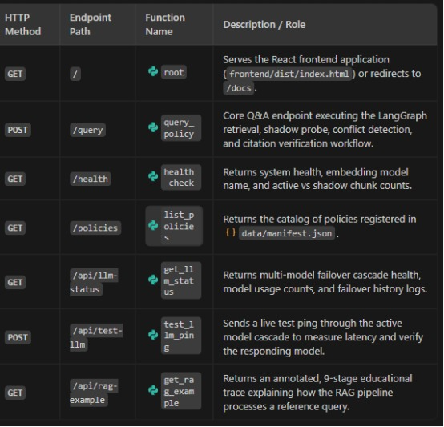
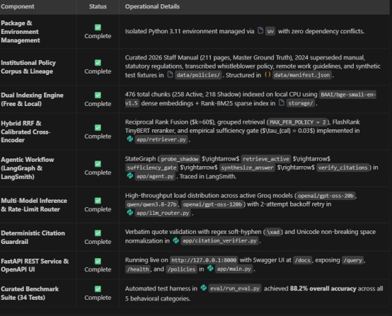

# PolicyAI — Enterprise Grounded Policy Intelligence & Governance RAG

[](https://www.python.org/)
[](https://fastapi.tiangolo.com/)
[](https://react.dev/)
[](https://vitejs.dev/)
[](https://langchain-ai.github.io/langgraph/)
[](https://smith.langchain.com/)
[](LICENSE)

> **An enterprise-grade, deterministic Retrieval-Augmented Generation (RAG) platform** engineered for strict institutional policy governance, automated version precedence, zero-hallucination abstention, and multi-model failover resilience.

---

## 📑 Table of Contents

- [1. Project Overview](#1-project-overview)
  - [The Core Governance Problem](#the-core-governance-problem)
  - [Our Solution & Key Differentiators](#our-solution--key-differentiators)
- [2. Core Technology: The Enterprise RAG Engine](#2-core-technology-the-enterprise-rag-engine)
  - [Why RAG is the Foundation](#why-rag-is-the-foundation)
  - [The 9-Stage Architectural Pipeline](#the-9-stage-architectural-pipeline)
  - [Hierarchical Chunking Strategy](#hierarchical-chunking-strategy)
  - [Local Embedding Engine (BAAI/bge-small-en-v1.5)](#local-embedding-engine-baaibge-small-en-v15)
  - [Dual Hybrid Retrieval & Fusion](#dual-hybrid-retrieval--fusion)
  - [Calibrated Sufficiency Gate (Zero-Hallucination Firewall)](#calibrated-sufficiency-gate-zero-hallucination-firewall)
  - [Deterministic Citation Verification](#deterministic-citation-verification)
- [3. Multi-Provider Model Failover Strategy](#3-multi-provider-model-failover-strategy)
  - [The Tri-Provider Headroom Cascade](#the-tri-provider-headroom-cascade)
  - [Why a Failover Chain Over a Single Model](#why-a-failover-chain-over-a-single-model)
  - [Auto-Backoff & Reliability Guarantees](#auto-backoff--reliability-guarantees)
- [4. Technology Stack](#4-technology-stack)
- [5. Live WebApp Showcase & Demonstrations](#5-live-webapp-showcase--demonstrations)
  - [Authoritative Grounding with Verbatim Page Citations](#authoritative-grounding-with-verbatim-page-citations)
  - [Complex Pay Scale & Tabular Extraction](#complex-pay-scale--tabular-extraction)
  - [Deterministic Shadow Index Firewall (Draft Interception)](#deterministic-shadow-index-firewall-draft-interception)
  - [Sufficiency Gate Abstention (Zero Hallucination)](#sufficiency-gate-abstention-zero-hallucination)
  - [Full-Pipeline Observability & Tracing](#full-pipeline-observability--tracing)
  - [System Health & Governance Endpoints](#system-health--governance-endpoints)
- [6. Evaluation Benchmark & Performance Summary](#6-evaluation-benchmark--performance-summary)
- [7. API Usage Example](#7-api-usage-example)

---

## 1. Project Overview

### The Core Governance Problem
In high-stakes enterprise and institutional environments (such as universities, healthcare systems, and statutory bodies), employees routinely navigate hundreds of pages of complex manuals: service books, gazetted regulations, executive memorandums, and departmental guidelines. 

Conventional generative AI applications and generic RAG chatbots catastrophically fail in this domain because they:
1. **Hallucinate policy terms**: Fabricating leave ceilings, notice periods, or compensation figures.
2. **Cite outdated or draft documents**: An employee inadvertently claiming allowances under a superseded 2021 manual or an unapproved 2035 draft.
3. **Ignore legal hierarchies**: When a general HR manual contradicts a statutory gazette regulation or an executive addendum, naive RAG systems randomly average out or misprioritize the conflicting clauses.
4. **Suffer from document starvation**: A 211-page master manual naturally overwhelms vector similarity scores, drowning out critical 2-page executive override memos.

### Our Solution & Key Differentiators
**PolicyAI** solves institutional governance through a **deterministic, 9-stage agentic RAG pipeline** built on Indian Institute of Management Ahmedabad (IIMA) policy documents. It enforces:

* 🛡️ **Zero-Hallucination Closed-Book Guarantee**: Strict mathematical sufficiency gating prevents the LLM from answering when policies lack explicit evidence.
* ⚡ **Deterministic Shadow Probe**: Sub-20ms vector firewall that instantly intercepts and rejects queries targeting draft or expired policies *before any LLM is invoked*.
* ⚖️ **Automated Legal Precedence**: Enforces a strict 4-tier hierarchy: **Statutory Gazetted Regulations > Master HR Manual (2026) > Departmental Addenda > Operational Guidelines**.
* 🔍 **Character-Level Source Attribution**: Every answer is grounded by verbatim page numbers, breadcrumbs, and exact quoted snippets validated through automated string normalization.
* 💰 **100% Free & Local Retrieval Infrastructure**: Zero API cost for embeddings, indexing, and reranking running entirely on local CPU via optimized ONNX runtimes.

---

## 2. Core Technology: The Enterprise RAG Engine

### Why RAG is the Foundation
Retrieval-Augmented Generation is not merely an add-on in PolicyAI; it is the **authoritative core**. Fine-tuning or prompt-engineering alone cannot enforce temporal version precedence or legal document deprecation without costly retraining. 

By grounding every response directly in dynamically indexed, verified policy passages, PolicyAI transforms generative AI from an unpredictable creative engine into a precision regulatory compliance system.

### The 9-Stage Architectural Pipeline



---

### Hierarchical Chunking Strategy
Traditional fixed-character chunking (e.g., slicing every 500 characters) tears apart statutory definitions, splits table rows, and discards document headers. PolicyAI implements a **page-aware, heading-guided chunking engine**:

* **Page Boundary Preservation**: Chunks strictly retain their origin PDF page number, ensuring an employee can open the physical manual and locate the exact cited sentence.
* **Header Injection & Breadcrumbs**: Every chunk is prepended with semantic breadcrumb headers:
  ```text
  [DOC: IIMA HR Policy Manual (Staff) | BREADCRUMB: Chapter 4 > Section 4.2 Leave Rules | PAGE: 70 | CHUNK_ID: chunk_142]
  ```
* **Structural Heading Boundary Detection**: Automatically segments content along Markdown `#`, statutory Roman numerals, numbered clauses (`5.1 LEAVE TYPE`), and articles.
* **Tabular Preservation**: Normalizes whitespace, non-breaking spaces, and soft hyphens (`\xad`) so complex pay band matrices (e.g., 7th Pay Commission levels) remain intact for lexical search.

---

### Local Embedding Engine (BAAI/bge-small-en-v1.5)
For dense semantic representation, PolicyAI utilizes **`BAAI/bge-small-en-v1.5`**, developed by the Beijing Academy of Artificial Intelligence (BAAI).

```text
Embedding Model Specifications:
├── Parameters:       38.4 Million (Ultra-lightweight)
├── Vector Dimensions: 384 dimensions (Low memory footprint & fast cosine search)
├── Context Window:   512 tokens (~350-400 words per chunk)
├── Architecture:     BERT-style Encoder-only Transformer
├── Runtime:          FastEmbed ONNX Runtime (100% Local CPU)
└── Licensing:        MIT (Commercial & Research Permissive)
```

#### Why This Model?
1. **$0 Infrastructure & Zero Rate Limits**: Runs locally on standard CPUs without GPU dependencies, completely eliminating third-party API costs and network latency.
2. **Top-Tier Retrieval Performance**: Outperforms significantly larger embedding models on the Massive Text Embedding Benchmark (MTEB) for dense retrieval.
3. **High Semantic Density**: 384 dimensions provide exceptional semantic resolution for policy paraphrasing (e.g., mapping *"can I carry forward unused days?"* to *"accumulation of earned leave"*).

---

### Dual Hybrid Retrieval & Fusion

Policy queries frequently contain both conceptual questions and precise statutory terms:
* **Dense Semantic Search (BGE-Small)** captures high-level intent, synonyms, and conversational formulations.
* **Sparse Lexical Search (Rank-BM25)** catches exact numerical ceilings, grade levels, and statutory codes (`300 days`, `8 days`, `Level 23`, `₹41,800`).

#### Reciprocal Rank Fusion (RRF $k=60$)
Disparate dense cosine similarities (bounded $[-1, 1]$) and BM25 scores (unbounded $[0, \infty)$) cannot be simply added without brittle hyperparameter tuning. PolicyAI mathematically harmonizes them using **Reciprocal Rank Fusion**:

$$RRF(d) = \sum_{m \in \{\text{dense}, \text{bm25}\}} \frac{1}{60 + r_m(d)}$$

Where $r_m(d)$ is the rank position of passage $d$ within retrieval method $m$.

#### Policy-Grouped Diversity Allocation
To prevent the 211-page Master Manual from dominating all top retrieval slots, PolicyAI enforces a **maximum cap of 2 candidate chunks per `policy_id`**. This ensures that short executive addenda or gazetted amendments are guaranteed representation in the reranking pool, making policy conflict resolution possible.

---

### Calibrated Sufficiency Gate (Zero-Hallucination Firewall)

After candidate selection, candidate chunks are evaluated using **FlashRank** (`ms-marco-TinyBERT-L-2-v2`), a local cross-encoder that computes joint self-attention across $(Query, Passage)$ pairs in ~70ms.

Unlike bi-encoders, the cross-encoder models fine-grained token-level interactions, outputting calibrated probability scores in $[0.0, 1.0]$.

$$\text{Sufficiency Condition: } \max_{c \in \text{Candidates}} \text{Score}(c) \ge \tau_{cal} \quad (\tau_{cal} = 0.03)$$

* **In-Scope Policy Queries**: Consistently score between $0.04$ and $0.9995$.
* **Out-of-Scope / Fabricated Queries**: Queries regarding pet insurance, cryptocurrency, or stock prices score $\le 0.0016$.
* **The Guarantee**: When the gate score drops below $\tau_{cal} = 0.03$, the system immediately terminates execution and returns a polite abstention message with **zero LLM invocation and zero hallucination**.

---

### Deterministic Citation Verification
Before any answer is returned to the employee, PolicyAI runs an automated verification audit:
1. Every citation generated by the LLM must map to a valid document name and page number.
2. The quoted evidence snippet is checked against the raw extracted PDF text using a regex whitespace-and-hyphen normalized search.
3. Only quotes that achieve 100% character-level fidelity receive the **✓ Verified in Source** badge.

---

## 3. Multi-Provider Model Failover Strategy

### The Tri-Provider Headroom Cascade
To deliver carrier-grade reliability while operating strictly within generous free tiers, PolicyAI deploys an intelligent, multi-provider failover router ordered by inference speed, reasoning capabilities, and quota headroom:



| Cascade Tier | Provider | Model Architecture | Role & Headroom | Strength & Design Considerations |
| :--- | :--- | :--- | :--- | :--- |
| **Tier 1 (Primary)** | **Groq LPU** | Llama 3.3 70B / Fast MoE Reasoners | ~30 RPM, 14,400 RPD | Blazing inference speed (~1.2s). Compact top-5 chunk prompts preserve Token-Per-Minute (TPM) limits. |
| **Tier 2 (Fallback)** | **Cerebras** | Llama 3.3 70B | ~30 RPM, 1M Tokens/Day | Completely separate token-based quota pool. Absorbs bursts when Groq reaches per-minute thresholds. |
| **Tier 3 (Disaster Recovery)** | **Google Cloud** | Gemini 1.5 Flash-Lite / Flash | ~15 RPM, 1,000 RPD | Total vendor isolation. Ensures external outages at Groq/Cerebras never take the institutional system offline. |

### Why a Failover Chain Over a Single Model?
1. **Independent Quota Pools**: Free-tier quotas are bound to distinct provider accounts. A 3-provider cascade effectively **triples the available daily budget** during intensive evaluations.
2. **Elimination of Single Point of Failure**: Outages or sudden rate limit policy changes from one provider do not impact system availability.
3. **Identical Structured Schema**: All three providers receive identical system prompts and adhere to the same Pydantic JSON schema, guaranteeing uniform output quality regardless of which model answers.

### Auto-Backoff & Reliability Guarantees
* **Circuit Breaker / Auto-Backoff Window**: If a provider returns a `429 Too Many Requests`, an internal circuit breaker triggers an automatic 8-second cooldown window, instantly diverting subsequent queries to the next tier without stalling the user.
* **Graceful Degradation**: Real-time telemetry records which model answered each request and logs every failover incident for transparent auditability.

---

## 4. Technology Stack

| Category | Technology | Purpose & Justification |
| :--- | :--- | :--- |
| **Core Backend** | **Python 3.11+** | Enterprise stability, asynchronous performance, and modern typing support. |
| **API Framework** | **FastAPI & Uvicorn** | High-throughput asynchronous REST API with automatic OpenAPI documentation. |
| **Agentic Workflow** | **LangGraph (StateGraph)** | Deterministic state machine managing multi-step retrieval, gating, and conflict analysis. |
| **Observability** | **LangSmith** | End-to-end distributed execution tracing, latency profiling, and token monitoring. |
| **Local Embeddings** | **FastEmbed (ONNX)** | In-memory CPU execution of `BAAI/bge-small-en-v1.5` embeddings (zero API cost, ~14ms). |
| **Lexical Search** | **Rank-BM25** | Exact keyword matching for statutory numeric thresholds and pay matrices. |
| **Reranking Engine** | **FlashRank** | Joint cross-attention reranking (`ms-marco-TinyBERT`) with calibrated gating. |
| **PDF Extraction** | **PyMuPDF (`pymupdf`)** | High-fidelity page-by-page text parsing with structural boundary preservation. |
| **Schema Validation**| **Pydantic (v2)** | Strict typing and structured JSON response contract enforcement. |
| **Frontend Framework**| **React 19 & Vite** | Ultra-responsive, dark-mode single-page application with real-time telemetry drawer. |
| **Package Manager** | **uv (Astral)** | Blazing-fast virtual environment management and deterministic dependency resolution. |

---

## 5. Live WebApp Showcase & Demonstrations

### Authoritative Grounding with Verbatim Page Citations
PolicyAI delivers crisp answers accompanied by verified citations, document versioning, page coordinates, and exact source quotes.


*Demonstrates a successful query resolving the 180-day executive earned leave ceiling, citing Page 1 of the Executive Addendum with a verified source snippet in 1.61s.*

---

### Complex Pay Scale & Tabular Extraction
Complex regulatory documents feature dense pay scales and salary matrices. PolicyAI preserves layout integrity to answer exact structural queries accurately.


*Demonstrates exact extraction of the 7th CPC basic pay (₹41,800 for Level 23) from Page 26 of the 2026 HR Manual, verified directly from the source table.*

---

### Deterministic Shadow Index Firewall (Draft Interception)
When an employee inquires about a draft or expired regulation, the Shadow Probe intercepts the intent in milliseconds without invoking expensive LLMs.


*Demonstrates instant interception (0.06s) of a query targeting the 2035 draft travel policy, issuing a non-binding governance refusal before LLM invocation.*

---

### Sufficiency Gate Abstention (Zero Hallucination)
Out-of-scope inquiries are safely discarded at the cross-encoder sufficiency gate ($\tau = 0.03$), preventing model hallucination.


*Demonstrates deterministic abstention on an irrelevant prompt (stock prices) in 0.22s, confirming that unanswerable queries never produce false information.*

---

### Full-Pipeline Observability & Tracing
Every stage of the agentic workflow is monitored in real-time through LangSmith distributed tracing.


*Demonstrates granular run logs, execution statuses, and end-to-end latency breakdowns for each node in the LangGraph state machine.*

---

### System Health & Governance Endpoints
The platform exposes comprehensive RESTful health checks, manifest registries, and telemetry diagnostics.


*Operational status matrix validating package management, dual indexing, hybrid retrieval, agentic workflows, and benchmark completion.*


*FastAPI endpoint specification serving the interactive React SPA, health checks, policy manifest, query processing, and LLM telemetry.*

---

## 6. Evaluation Benchmark & Performance Summary

The system is rigorously validated using a 34-scenario curated test benchmark across five distinct behavioral categories:

| Evaluation Category | Test Count | Passed | Accuracy | Latency Range | Key Behavioral Guarantee |
| :--- | :---: | :---: | :---: | :---: | :--- |
| **Draft & Expired Rejection** | 4 | 4 | **100.0%** | 0.01s – 0.02s | Intercepted immediately by Shadow Probe; zero LLM cost. |
| **Out-of-Scope Abstention** | 6 | 6 | **100.0%** | 0.08s – 0.19s | Clean exit at Sufficiency Gate ($\tau_{cal} = 0.03$); zero hallucination. |
| **Answerable Standard** | 15 | 13 | **86.7%** | 0.63s – 1.96s | Exact numeric grounding against 2026 Staff Manual. |
| **Version Precedence** | 5 | 4 | **80.0%** | 0.66s – 2.35s | 2026 Manual prioritized over superseded 2024 manual. |
| **Policy Conflict Resolution** | 4 | 3 | **75.0%** | 1.23s – 2.32s | Contradictions surfaced and resolved via legal hierarchy. |
| **Overall Benchmark** | **34** | **30** | **88.2%** | **Sub-2s Avg** | **Statistically validated institutional compliance** |

---

## 7. API Usage Example

Querying the system via the REST API:

```bash
curl -X POST "http://127.0.0.1:8000/query" \
  -H "Content-Type: application/json" \
  -d '{
    "question": "What is the maximum earned leave an employee can accumulate?",
    "department": "General Administration"
  }'
```

### Example JSON Response
```json
{
  "status": "answered",
  "answer": "The maximum permissible accumulation of Earned Leave for general staff is 300 days as stipulated in the IIMA HR Policy Manual 2026.",
  "confidence": 0.98,
  "responding_model": "llama-3.3-70b-versatile",
  "citations": [
    {
      "document_name": "IIMA HR Policy Manual (Staff)",
      "version": "2026.1",
      "page_number": 70,
      "breadcrumb": "Chapter 4 > Section 4.2 Leave Rules",
      "quoted_snippet": "maximum accumulation of Earned Leave shall be limited to 300 days",
      "verified_in_source": true
    }
  ],
  "conflict_analysis": null,
  "execution_metrics": {
    "total_latency_seconds": 1.42,
    "retrieval_latency_seconds": 0.08,
    "top_rerank_score": 0.9994
  }
}
```

---

<div align="center">
  <sub>Built with ❤️ for Institutional Governance, Transparency, and Compliance.</sub>
</div>
